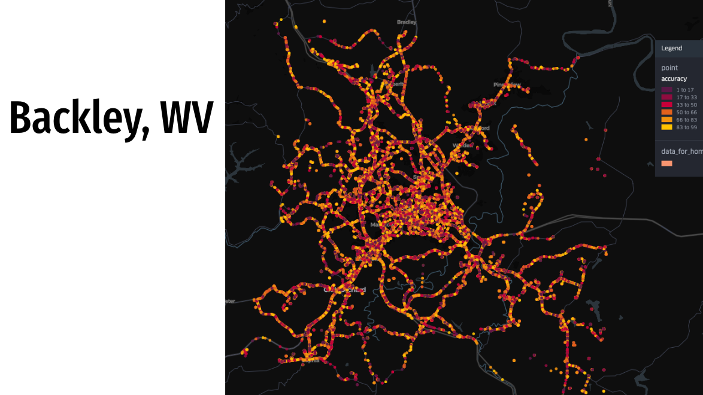

# Mobile Movement Geo-Location Analytics

## Project Overview
This repository contains a comprehensive analysis of mobile device movement patterns using geolocation data. The project focuses on analyzing mobility patterns, activity levels, and user behavior to identify qualified mobile active users (QMAU) for location-based analytics applications.

## 📊 Data Description
The dataset (`mobility_data.csv.zip`) contains approximately 845,000 records of mobile device locations with the following features:
- `device_id`: Unique identifier for each mobile device
- `timestamp`: Unix timestamp of when the location data was recorded
- `latitude` & `longitude`: Geographic coordinates
- `accuracy`: Accuracy of the location data in meters
- `os`: Operating system of the device (Android/iOS)

The data spans three geographic areas:
- Austin, Texas
- Portland, Oregon
- Beckley, West Virginia

## 📱 Analysis Focus
This project explores several aspects of mobility data:

1. **Temporal Activity Analysis**
   - Hourly and daily distribution of device activity
   - Peak activity hours and days identification
   - Active days per device across the month

2. **Movement Pattern Analysis**
   - Geohash-based movement tracking (level 7 precision ~153m x 153m)
   - Identification of normal vs. excessive movement patterns
   - Geographic distribution of activity across three cities

3. **Qualified User Identification**
   - Development of criteria for identifying high-quality mobile active users
   - Filtering devices based on consistent activity patterns
   - Segmentation of users by operating system and geographic location

## 🔍 Key Findings

### Temporal Activity Patterns
- Peak activity hours occur at 6 AM, 3 PM, and 10-11 PM
- Higher device activity on weekdays compared to weekends
- 75% of devices are active on all 31 days of the month

### Movement Patterns
- Normal daily movement defined as 8-97 unique geohashes visited per day
- Median of 59 unique geohashes visited per device-day
- Total monthly movement ranges widely, with 75th percentile at 819 unique locations

### Qualified Mobile Active Users (QMAU)
- Defined based on:
  - Active on at least 25 days per month
  - Shows activity during peak hours
  - Exhibits normal movement patterns (8-97 geohashes per day)
- The analysis identified a significant percentage of the devices as qualified users

## 📊 Visualizations
The repository includes several key visualizations:
- Daily and hourly activity distributions
- Movement pattern analysis
- Geographic distributions across Austin, Portland, and Beckley
- OS-based segmentation of active users

.png)
.png)

## 🚀 Usage
1. Clone this repository
2. Unzip the `mobility_data.csv.zip` file
3. Run the `mobility_analytics.ipynb` notebook in Jupyter/Colab

```python
# Example to load the dataset
import pandas as pd

data = pd.read_csv('mobility_data.csv')
data['timestamp'] = pd.to_datetime(data['timestamp'], unit='s')
```

## 🛠️ Requirements
- Python 3.7+
- pandas
- numpy
- plotly
- geohash2

## 📍 Geographic Coverage
The analysis covers three distinct geographic areas:

### Austin, Texas


### Portland, Oregon


### Beckley, West Virginia


## 🔬 Methodology
1. **Data Preprocessing**
   - Converting timestamps to datetime objects
   - Converting coordinates to geohashes for movement analysis
   - Extracting temporal features (hour, day of week)

2. **Activity Analysis**
   - Identifying active days and hours per device
   - Analyzing distribution of activity across time
   - Determining thresholds for "normal" activity levels

3. **Movement Analysis**
   - Using geohashes to analyze geographic movement
   - Establishing thresholds for normal vs. excessive movement
   - Visualizing movement patterns using histograms and violin plots

4. **Qualified User Classification**
   - Establishing criteria based on activity level, time of activity, and movement patterns
   - Filtering devices that meet the criteria
   - Analyzing the resulting qualified user base

## 🔮 Potential Applications
- Location-based advertising targeting
- Urban planning and transportation optimization
- Business site selection based on foot traffic patterns
- Consumer behavior analysis for retail and service industries

## 📝 Conclusion
This analysis provides a framework for identifying high-quality mobile active users based on consistent and normal movement patterns. The methodology can be applied to larger datasets and different geographic regions to establish location-based analytics for various business applications.

## 🔄 Future Work
- Incorporate point-of-interest (POI) data to analyze visits to specific business types
- Develop predictive models for user movement patterns
- Extend the analysis to additional geographic regions
- Integrate demographic data for more detailed user segmentation

---

For questions or contributions, please open an issue or submit a pull request.
